# Welcome to the countryside!

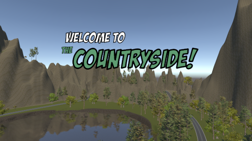

"Welcome to the countryside!" es el nombre de mi prototipo para la primera Práctica de Evaluación Continua (PEC1) de la asignatura Programación de Videojuegos 3D del Máster Universitario en Diseño y Programación de Videojuegos de la UOC.

El objetivo de la práctica era implementar un modo contrarreloj, así como otros añadidos, al tutorial de conducción de coches incorporado en los StandardAssets de Unity, utilizando los conocimientos adquiridos en el estudio del primer módulo de la asignatura y realizando investigación por cuenta propia.

## Vídeo explicativo

## Versión jugable

[Welcome to the Countryside! by Ragart on itch.io](https://ragart.itch.io/welcome-to-the-countryside)

## Versión de Unity

La versión de Unity utilizada para el desarrollo de la práctica es la 2021.3.19f1 LTS.

## Cómo jugar

El objetivo del juego es lograr el mejor tiempo en los circuitos disponibles. El jugador puede elegir entre dos circuitos y cuatro coches diferentes, cada uno con sus características, y puede configurar una carrera de entre 1 y 9 vueltas.

Una vez se haya completado la primera vuelta de un circuito, el jugador podrá competir contra el fantasma de su mejor vuelta. Cuando haya completado una carrera entera, se enfrentará al fantasma de su mejor carrera.

El control se lleva a cabo mediante el teclado:

- La `flecha superior` y la tecla `W` sirven para acelerar.
- La `flecha inferior` y la tecla `S` sirven para frenar y dar marcha atrás.
- La `flecha izquierda` y la tecla `A` sirven para girar a la izquierda.
- La `flecha derecha` y la tecla `D` sirven para girar a la derecha.
- La `barra espaciadora` sirve para frenar con el freno de mano.
- La tecla `Control izquierdo` sirve para reiniciar desde el último punto de control.
- La tecla `Escape` sirve para pausar el juego y abrir el menú de pausa.

## Desarrollo

De cara a completar el desarrollo de la práctica, se han llevado a cabo todas las tareas obligatorias y opcionales, además de incluir algunos extras que se han ido añadiendo a lo largo del desarrollo.

En orden de implementación:

- Se ha completado los proyectos propuestos en el Módulo 1 de la asignatura para familiarizarse con el código existente en los StandardAssets.

- Se ha llevado a cabo una refactorización parcial del código existente en los StandardAssets, así como una limpieza de los *assets* en desuso, aunque se ha optado por evitar modificar el código en la medida de lo posible y es posible que se mantengan *assets* huérfanos en el proyecto por la incertidumbre relativa a su uso actual.

- Se ha implementado un sistema de *checkpoints* para asegurar que el jugador completa el circuito completo, pero también para permitirle reiniciar desde el último en caso de errores.

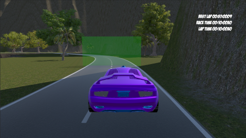

- Se ha implementado el modo contrarreloj, que permite al jugador competir contra el tiempo y contra sus propios registros, utilizando un coche fantasma y mostrando en todo momento los tiempos en pantalla. Inicialmente, el fantasma se implementó únicamente para la mejor vuelta, pero debido a una relectura de las instrucciones, se ha implementado también para la mejor carrera, de manera que queda así:
  - La primera vez que el jugador corre un circuito, el fantasma no aparece hasta que no completa la primera vuelta. Durante esa primera carrera, el jugador compite contra el fantasma de su mejor vuelta.
  - Una vez que el jugador ha completado la primera carrera, el fantasma aparece desde el inicio de la siguiente y el jugador compite contra el fantasma de su mejor carrera completa.

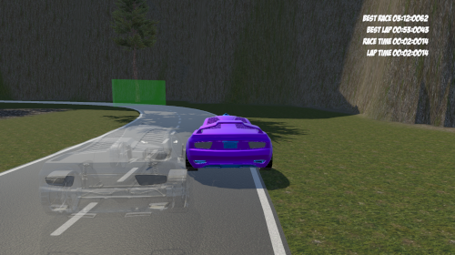

- Se ha implementado un sistema que almacena los mejores tiempos de cada circuito tanto por vuelta como por carrera completa, utilizando el `persistenteDataPath` de Unity para almacenar los datos en varios ficheros JSON, aunque también se utiliza `Resources.Load()` para comprobar si existen datos de tiempo en la *build*. En el caso de los ficheros por carrera completa, se almacena el tiempo de cada vuelta y se separan por circuito, pero también por el número de vueltas elegidas por el jugador.

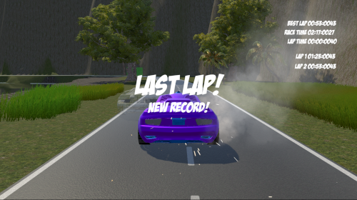

- Se ha implementado un sistema que ralentiza el coche cuando sale de la pista, aplicando directamente un penalizador del 50% a la propiedad `maxSpeed` del coche. Como de esta manera la frenada era muy abrupta, se optó por considerar el número de ruedas que se encuentran fuera de la pista para aplicar un ralentizador más suave. La penalización total sólo se aplica cuando las cuatro ruedas están fuera de la pista y se aplica de forma progresiva y proporcional a medida que van saliendo.

- Se ha implementado un sistema de daño muy básico que penaliza una única vez la propiedad `maxSpeed` del coche cuando se golpea contra un objeto y que activa un sistema de partículas. Esta penalización puede acumularse a la que se produce al salir de la pista, por lo que el coche puede llegar a ralentizarse hasta un 75% de su velocidad máxima.

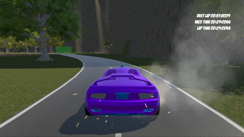

- Se ha implementado una funcionalidad que devuelve al jugador al último *checkpoint* en caso de caer al agua.

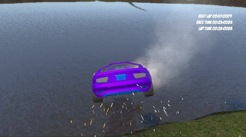

- Se ha implementado un sistema de pausa que permite al jugador pausar la partida en cualquier momento y salir del juego.

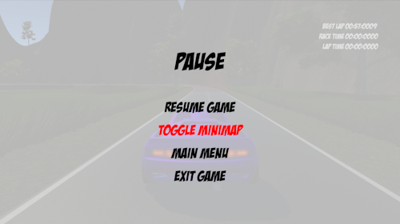

- Se ha implementado un sistema de repetición de la carrera utilizando Cinemachine ClearShot.

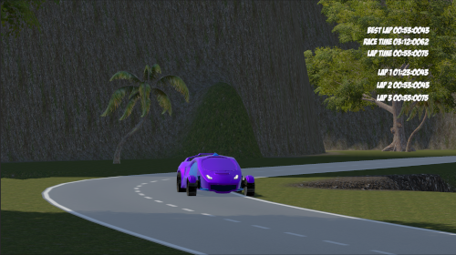

- Se han creado dos circuitos de carácter montañoso y con atajos, así como cuatro coches diferentes, tanto en color como en características. Adicionalmente, se ha añadido un menú principal y pantallas de selección de circuito y coche.

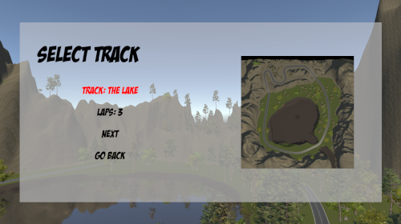

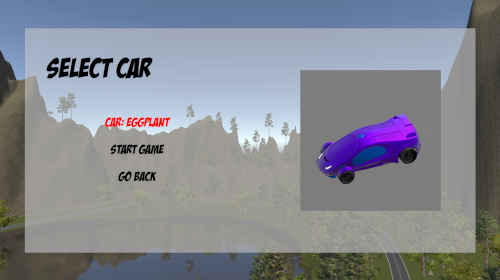

- Se han añadido música y sonidos en diferentes momentos del juego.

- Se ha implementado un sistema de minimapa utilizando una cámara ortográfica y Cinemachine.

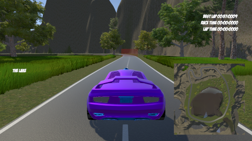

- Se ha probado la *build* para Windows 11 64 bits y para WebGL.

## Problemas conocidos

- Dado que el ratón no ha podido desactivarse por completo debido al uso del sistema de input antiguo, en ocasiones es posible desactivar por error la navegación en los menús y es necesario reiniciar la aplicación.

## Créditos

### Standard Assets

Todos los recursos incluidos en los Standard Assets son propiedad de Unity Technologies.

### EasyRoads3D

- EasyRoads3d es propiedad de UnityTerrainTools

### Música y sonido

- "EOI Breakdown" -  Raul Cabezali - https://licensing.jamendo.com/en/track/758061/eoi-breakdown
- "Outdoors Folk 2 No Banjo or Brass" - Musictown - https://pixabay.com/es/music/optimista-outdoors-folk-2-no-banjo-or-brass-28595/
- "Running Fiddlers Country Band" - 23117649 - https://pixabay.com/es/music/pais-tradicional-running-fiddlers-country-band-7742/
- "Yeehaw!" - shawshank73 - https://freesound.org/people/shawshank73/sounds/102437/

### Fuentes

- "Badaboom BB" - Blambot - https://www.dafont.com/es/badaboom-bb.font
- "Christopher Hand" - El Stinger - https://www.dafont.com/christopherhand.font

## Referencias

### Unity - General

- "Pause in Unity WITHOUT Timescale" - James Makes Games [YouTube] - https://www.youtube.com/watch?v=KPaEnLpu57s
- "How to Make a Teleportation System in Unity (FREE form/Fixed)" - JTA Games [YouTube] - https://www.youtube.com/watch?v=pNGwPrjnwfo
- "Simple Checkpoint System in Unity" - Code Monkey [YouTube] - https://www.youtube.com/watch?v=IOYNg6v9sfc

### Scriptable Objects

- "Scriptable Objects in Unity (how and when to use them)" - John French [gamedevbeginner] - https://gamedevbeginner.com/scriptable-objects-in-unity/

### Standard Assets

- "Get Standard Assets in Unity 2022, 2021, 2020, 2019 WITHOUT account sign-in" - qubodupDev [YouTube] - https://www.youtube.com/watch?v=MCxodymLvA8

### Terrain

- "Collision with water" - msborat [Unity Forums] - https://forum.unity.com/threads/collision-with-water.51778/
- "Adding water and water effects on Unity 2021 or greater version" - Computing Academy [YouTube] - https://www.youtube.com/watch?v=i74uHejgccg

### EasyRoads3D

- "EasyRoads3D v3.2+ for Unity - Introduction - Getting Started" - EasyRoads3D [YouTube] - https://www.youtube.com/watch?v=fIcdU8AveXA

### TextMeshPro

- "Why is my TextMesh Pro text is blurry?" - retropxgames [Unity Forums] - https://forum.unity.com/threads/why-is-my-textmesh-pro-text-is-blurry.698909/

### Cinemachine

- "Intelligent Camera Switching Using Clearshot Cameras in Cinemachine" - Chris Hilton [Medium] - https://christopherhilton88.medium.com/intelligent-camera-switching-using-clearshot-cameras-in-cinemachine-543e1c6e0965
- "Using Cinemachine: Clear Shot" - Unity [YouTube] - https://www.youtube.com/watch?v=I9w-agFYZ3I